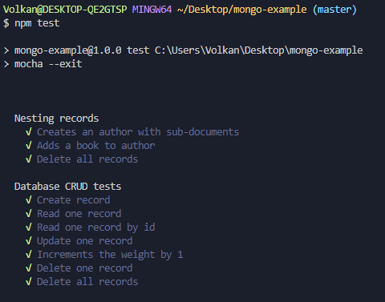

# MongoDB Example TDD

Basic Crud operations with MongoDB using TDD

## Tests

- Nesting records

    √ Creates an author with sub-documents

    √ Adds a book to author

    √ Delete all records
- Database CRUD tests
    √ Create record

    √ Read one record

    √ Read one record by id

    √ Update one record

    √ Increments the weight by 1

    √ Delete one record

    √ Delete all records

## ScreenShot

